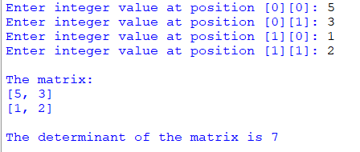

## Description
This program  allows users to input a 2x2 matrix and calculates its determinant using a simple function.   
The determinant of a 2x2 matrix [a, b; c, d] is computed as ad - bc.  
Users will be prompted to enter integer values for each position in the matrix. The program then calculates the determinant using the provided function and displays the result.
## Example

